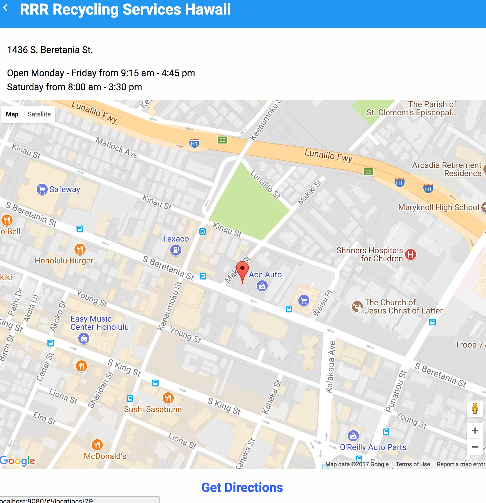

Redeem HI5 is a mobile web application that uses the device's location to find the nearest recycling centers. It was built using Vue.js and Webpack and was an experiment in seeing how Vue.js works.

For this app, I designed the layout myself and built it using CSS flexbox. The app also has offline support, so once the list of recycling centers is downloaded it is cached on the device, so the device does not need to be connected to the internet for the website to work.
 
Source: <a href="https://github.com/keokilee/hi5-redemption"><i class="large github icon"></i>keokilee/hi5-redemption</a>